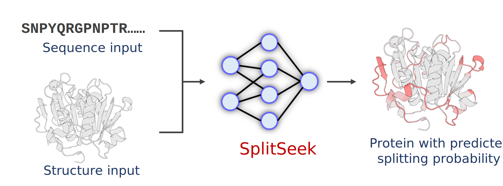

<h1 align="center">SplitSeek-Pro</h1>
<p align="center">Accurate prediction of splittable sites on protein structures</p>



## Install software on Linux (Conda)

1. Download `SplitSeek-Pro`

```bash
git clone https://github.com/pkwyx/SplitSeek.git
cd SplitSeek
```

2. Install `Anaconda` / `Miniconda` software

3. Follow the steps below to install the Python package or run the command `conda env create -f environment/splitseek_pro.yml`

```bash
conda create -n splitseek_pro python=3.12
conda activate splitseek_pro

pip install -e .
pip install fair-esm transformers

```

## Usage

```bash
# run single predictions
python run.py -i examples/inputs/single/4eb0.pdb -o examples/outputs/4eb0

# run multiple predictions (put all the pdb files into a folder)
python run.py -i examples/inputs/multi -o examples/outputs/multi

```

## Instructions

1. SplitSeek-Pro is a deep learning–based method designed to evaluate the feasibility of protein engineering strategies involving residue-level splitting, such as circular permutation or split–reconstitutions. The method integrates both sequence information (ESM2-650M embeddings and AAindex encodings) and structural information (pairwise atomic distances) to estimate the splitting probability for each amino acid residue.

2. Currently, users can submit files in PDB format or CIF format to obtain per-residue splitting probability predictions.

3. SplitSeek-Pro outputs: A predicted PDB file, where the original B-factor column is replaced with the corresponding splitting scores (0–100). Users can download these files and visualize them locally (e.g., in PyMOL) by coloring residues based on the B-factor.

4. A score of 0.5 is recommended as the threshold to distinguish between feasible and infeasible splitting sites.

## Tips

1. In all tests, we found that the predicted score is most representative of the feasibility of splitting between residue n and residue n+1.

2. Continuous regions with ≥3 consecutive residues scoring above 0.8 generally indicate high splitting feasibility.

3. Single high-scoring residues within a continuous region are less likely to be practically feasible.

4. The model was trained in two stages: Pretraining on a split–reconstitution dataset while fine-tuning on circular permutation data from structurally similar proteins. Because the fine-tuning dataset is derived from circular permutation examples, predictions are especially suited for circular permutation site identification.

5. Predictions tend to be more reliable for proteins with fewer than 400 residues.

## Reference

[Accurate Prediction of Splittable Sites on Protein Structures]
